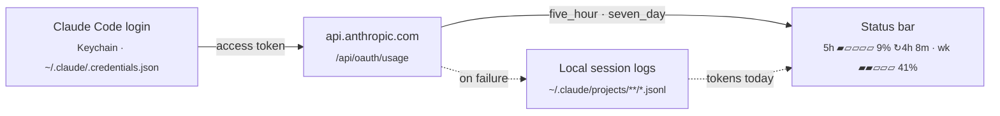

<p align="center">
  
</p>

<h1 align="center">Tokenwatch</h1>

<p align="center">
  <strong>Your Claude Code quota, live in the VS Code status bar.</strong><br>
  Stop typing <code>/usage</code> mid-flow to find out whether you're about to hit the wall.
</p>

<p align="center">
  <a href="https://github.com/kabartay/tokenwatch/actions/workflows/ci.yml"></a>
  <a href="https://github.com/kabartay/tokenwatch/releases/latest"></a>
  <a href="LICENSE"></a>
  <a href="package.json"></a>
  <a href="tsconfig.json"></a>
  <a href="package.json"></a>
  <a href="#caveats"></a>
</p>

```
5h ▰▱▱▱▱ 9% ↻4h 8m · wk ▰▰▱▱▱ 41%
```

## Features

- **Live session (5h) and weekly (7d) quota**, from the same source `/usage` reads, with a
  mini progress bar for each.
- **Reset countdown** right in the status bar: `↻4h 8m` until the 5-hour session resets.
- **Pace projection.** The tooltip shows where each window is heading at your pace so far:
  "~45% at reset", or "runs out in 1h 20m" if you'll hit the limit first.
- **Warnings before it's too late.** The text turns **yellow** when you're on pace to run out
  before the reset, the item turns **amber** at your threshold or when the limit is under an
  hour away, and **red** at 100%.
- **Zero setup.** Reuses your existing Claude Code login; nothing to paste, no API key.
- **Graceful fallback.** If live quota is unavailable, it shows today's token count from your
  local session logs, and says why, instead of going stale or showing a wrong number.
- **Light.** Unfocused windows skip polls, the fallback reads only newly written log bytes,
  and there are no runtime dependencies.

## Install

1. Download `tokenwatch-<version>.vsix` from the
   [latest release](https://github.com/kabartay/tokenwatch/releases/latest).
2. In VS Code, open Extensions (`Cmd+Shift+X`), click **`···`** at the top right of the panel,
   choose **Install from VSIX…**, and pick the file.
3. Reload the window: `Cmd+Shift+P` → **Developer: Reload Window**.

From a terminal, run `code --install-extension tokenwatch-*.vsix`. With the `gh` CLI,
`./install.sh` downloads and installs the latest release in one step. Updates aren't
automatic, so repeat this for each release.

## Usage

The item sits at the right end of the status bar and refreshes every 60 seconds.

| Shows | Meaning |
| --- | --- |
| `5h ▰▱▱▱▱ 9% ↻4h 8m · wk ▰▰▱▱▱ 41%` | Live quota: share used of the 5-hour session (resetting in 4h 8m) and of the week. |
| `~1.2M tok today` | Live quota unavailable. Shows tokens logged locally today, and the tooltip says why. |
| `Claude: log in` | No Claude Code login found. Run `claude` and log in. |
| `Claude usage` in red | Nothing worked. The tooltip has the error. |

- **Hover** for a table of both windows: usage bar, pace projection and exact reset times.
- **Click** to refresh now.
- `Cmd+Shift+P` → **Tokenwatch: Refresh Claude Usage** refreshes and shows the result in a
  notification, which helps if the item is out of view.
- `Cmd+Shift+P` → **Tokenwatch: Show Log** shows what each refresh did.

## Configuration

| Setting | Default | Description |
| --- | --- | --- |
| `tokenwatch.pollIntervalSeconds` | `60` | Seconds between refreshes (minimum 30). |
| `tokenwatch.warnThresholdPercent` | `80` | Turn amber at or above this percentage. |
| `tokenwatch.statusBarStyle` | `bars` | `bars` shows `5h ▰▱▱▱▱ 9%`; `compact` shows `5h 9%`. |
| `tokenwatch.showResetCountdown` | `true` | Show `↻4h 8m` until the session resets. |

Changes apply immediately, with no reload.

## How it works



On every poll, Tokenwatch:

1. **Reads your login.** It reads the OAuth token Claude Code already stores. The token is
   re-read each time, so a token Claude Code refreshes is picked up without a reload.
2. **Asks for your quota.** It calls the endpoint behind `/usage` and reads the 5-hour and
   7-day utilization and reset times.
3. **Projects your pace.** Each window has a fixed length, so its reset time also gives its
   start. Dividing usage by time elapsed gives your average pace, and extending that pace
   predicts where you'll be at the reset. No history is stored, so this works from the
   first poll and survives reloads. It needs at least 10 minutes of elapsed window.
4. **Falls back if live quota fails.** It sums today's tokens from your local Claude Code session
   logs. That's consumption, not remaining quota, because only the server knows your plan's
   limits. The tooltip says why live data was unavailable.

The internals are explained in [Architecture](docs/ARCHITECTURE.md), and the endpoint
details are in [Usage endpoint](docs/USAGE_ENDPOINT.md).

## Privacy

- Your access token is sent **only** to `api.anthropic.com`, over HTTPS.
- It is never logged or written to disk, and a unit test checks that it never reaches the
  log.
- The fallback reads your local session logs for token counts only. Nothing else is
  extracted from them, and nothing from them leaves your machine.
- There's no telemetry and there are no runtime dependencies.

The Tokenwatch log records refresh outcomes and error messages. If the endpoint's reply
isn't recognised, the log also includes up to 1,000 characters of that reply.
[SECURITY.md](SECURITY.md) lists exactly what is read, sent and logged.

## Caveats

**Tokenwatch is unofficial and not affiliated with Anthropic.** It relies on an undocumented
endpoint that can change or disappear without notice. If that happens, Tokenwatch switches
to the local fallback, and the log records the response so it can be fixed quickly.

## Documentation

| | |
| --- | --- |
| [Troubleshooting](docs/TROUBLESHOOTING.md) | Unexpected status, reading the log, Keychain access. |
| [Usage endpoint](docs/USAGE_ENDPOINT.md) | Request, response and status codes, and what to do when it changes. |
| [Architecture](docs/ARCHITECTURE.md) | Layers, the refresh decision, design decisions. |
| [Development](docs/DEVELOPMENT.md) | Build, test, conventions and the release checklist. |
| [Changelog](CHANGELOG.md) | What changed in each version. |

## License

[MIT](LICENSE) © Mukharbek Organokov
