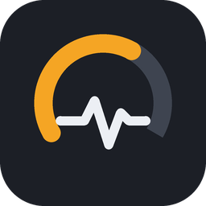
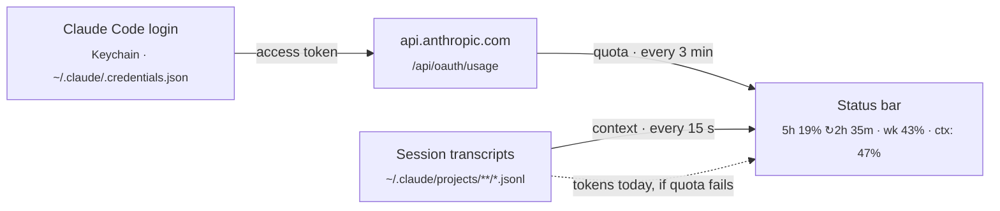

<p align="center">
  
</p>

<h1 align="center">Tokenwatch</h1>

<p align="center">
  <strong>Your Claude Code quota and context, live in the VS Code status bar.</strong><br>
  Stop typing <code>/usage</code> or <code>/context</code> mid-flow to find out whether you're about to hit the wall.
</p>

<p align="center">
  <a href="https://github.com/kabartay/tokenwatch/actions/workflows/ci.yml"></a>
  <a href="https://github.com/kabartay/tokenwatch/releases/latest"></a>
  <a href="LICENSE"></a>
  <a href="package.json"></a>
  <a href="tsconfig.json"></a>
  <a href="package.json"></a>
  <a href="#caveats"></a>
</p>

```
5h ▰▱▱▱▱ 19% ↻2h 35m · wk ▰▰▱▱▱ 43% · ctx: 47%
```

| Part | Means |
| --- | --- |
| `5h ▰▱▱▱▱ 19%` | 19% of the 5-hour session quota used |
| `↻2h 35m` | the 5-hour session resets in 2 h 35 min |
| `wk ▰▰▱▱▱ 43%` | 43% of the weekly quota used |
| `ctx: 47%` | this folder's Claude Code session has filled 47% of its context window, as `/context` shows |

Hover over it for the details: both quota windows with their reset times and a pace forecast
("~45% at reset", or "runs out in 1h 20m"), plus the context's token count and model.

## Features

- **Quota and context on one line**, from the same sources `/usage` and `/context` read.
- **Pace forecast.** Tells you before you run out, not after.
- **Colours that warn early.** Yellow when you're on pace to run out before the reset, amber
  past your threshold or within the hour, red at 100%.
- **Zero setup.** Reuses your existing Claude Code login: nothing to paste, no API key.
- **Calm under rate limits.** It backs off politely, keeps your last numbers on screen, and
  remembers them across window reloads.
- **Light and auditable.** No runtime dependencies, no telemetry. Unfocused windows don't poll.

## Install

**Requirements:** VS Code 1.85 or newer, and Claude Code installed and logged in (`claude`).

1. Download `tokenwatch-<version>.vsix` from the
   [latest release](https://github.com/kabartay/tokenwatch/releases/latest).
2. In VS Code, open Extensions (`Cmd+Shift+X`), click **`···`** at the top right of the panel,
   choose **Install from VSIX…**, and pick the file.
3. Reload the window: `Cmd+Shift+P` → **Developer: Reload Window**.

From a terminal: `code --install-extension tokenwatch-*.vsix`. With the `gh` CLI,
`scripts/install.sh` downloads and installs the latest release in one step. Updates aren't
automatic, so repeat this for each release.

### Recommended setting

Claude Code transcripts record the model but not its context window size. If your models run
with a 1M window (`/context` shows `/ 1.0M tokens`), tell Tokenwatch so `ctx` is right from
the first reply:

```jsonc
// settings.json
"tokenwatch.contextWindowTokens": { "claude-opus": 1000000, "claude-sonnet": 1000000 }
```

## Usage

The item sits at the right end of the status bar.

- **Hover** for the full breakdown.
- **Click** to refresh. The numbers stay put and only the icon spins.
- `Cmd+Shift+P` → **Tokenwatch: Refresh Claude Usage** refreshes and shows the result in a
  notification, which helps if the item is out of view.
- `Cmd+Shift+P` → **Tokenwatch: Show Log** shows what each refresh did, in the same one-line
  form:

  ```text
  2026-10-07 23:49:52.876 [info] Tokenwatch 0.5.1 activated
  2026-10-07 23:49:52.903 [info] 5h 25% ↻1h 50m · wk 44% · ctx: 63%
  2026-10-07 23:49:53.995 [info] 5h 25% ↻1h 50m · wk 44% · ctx: 63%
  ```

| Colour | When |
| --- | --- |
| Default | Comfortable pace. |
| Yellow text | At this pace, a quota window runs out before it resets; or context is past 70%. |
| Amber background | A quota window is past your threshold (80%) or runs out within the hour; or context is past 90%. |
| Red background | A quota window is used up. |

| Other states | Meaning |
| --- | --- |
| `~1.5M tok today` | Live quota is unavailable and there are no recent numbers to show, so it counts today's tokens from local logs instead. The tooltip says why. |
| `Claude: log in` | No Claude Code login found. Run `claude` and log in. |
| `Claude usage` in red | Nothing worked. The tooltip has the error. |

## Configuration

| Setting | Default | Description |
| --- | --- | --- |
| `tokenwatch.pollIntervalSeconds` | `180` | Seconds between quota requests (minimum 60). Faster polling draws rate limits. |
| `tokenwatch.warnThresholdPercent` | `80` | Turn amber at or above this percentage. |
| `tokenwatch.statusBarStyle` | `bars` | `bars` shows `5h ▰▱▱▱▱ 19%`; `compact` shows `5h 19%`. |
| `tokenwatch.showResetCountdown` | `true` | Show `↻2h 35m` until the session resets. |
| `tokenwatch.showContext` | `true` | Append `ctx: N%` for this folder's Claude Code session. |
| `tokenwatch.contextWindowTokens` | `{}` | Context window per model: an exact id, a prefix such as `"claude-opus"`, or `"*"`. Unlisted models assume 200k, or 1M once a session passes 200k. |

Changes apply immediately, with no reload.

## How it works



- **Quota** comes from the endpoint behind `/usage`, called with the login Claude Code already
  stores. The token is re-read on every request, so a token Claude Code refreshes is picked
  up automatically.
- **Pace** needs no history. Each window has a fixed length, so its reset time also gives its
  start, and usage divided by elapsed time is your average pace.
- **Context** is read from the end of the newest transcript for this folder: the token count
  of the last reply, which is what `/context` reports.
- **Rate limits.** The endpoint's limit is shared with Claude Code itself, so Tokenwatch polls
  every 3 minutes, backs off for at least 3 more after a 429, and keeps the last numbers on
  screen meanwhile. The reset countdown and `ctx` keep updating every 15 seconds.

The internals are in [Architecture](docs/ARCHITECTURE.md), and the endpoint details are in
[Usage endpoint](docs/USAGE_ENDPOINT.md).

## FAQ

**`ctx` looks too high.**
Your model probably has a 1M window. See [Recommended setting](#recommended-setting).

**No `ctx` at all?**
It appears only for a Claude Code session started in a folder open in this window. See
[Troubleshooting](docs/TROUBLESHOOTING.md#ctx-is-missing-from-the-line).

Anything else, such as `~1.5M tok today` or rate limits, is covered in
[Troubleshooting](docs/TROUBLESHOOTING.md).

## Privacy

- Your access token is sent **only** to `api.anthropic.com`, over HTTPS. It is never logged or
  stored, and a unit test checks that it never reaches the log.
- Transcripts are read for token counts, model ids and timestamps only. Nothing from them
  leaves your machine.
- The last quota response (percentages and reset times) is kept in VS Code's extension storage
  so a reload can show it at once.
- No telemetry, no runtime dependencies.

[SECURITY.md](docs/SECURITY.md) lists exactly what is read, sent, stored and logged.

## Caveats

**Tokenwatch is unofficial and not affiliated with Anthropic.** It relies on an undocumented
endpoint that can change or disappear without notice. If that happens, Tokenwatch falls back
to local token counts, and the log records the response so it can be fixed quickly.

## Documentation

| | |
| --- | --- |
| [Troubleshooting](docs/TROUBLESHOOTING.md) | Unexpected status, reading the log, Keychain access. |
| [Usage endpoint](docs/USAGE_ENDPOINT.md) | Request, response, status codes and rate limits. |
| [Architecture](docs/ARCHITECTURE.md) | Layers, the refresh decision, design decisions. |
| [Development](docs/DEVELOPMENT.md) | Build, test, conventions and the release checklist. |
| [Changelog](CHANGELOG.md) | What changed in each version. |

## License

[MIT](LICENSE) © Mukharbek Organokov
