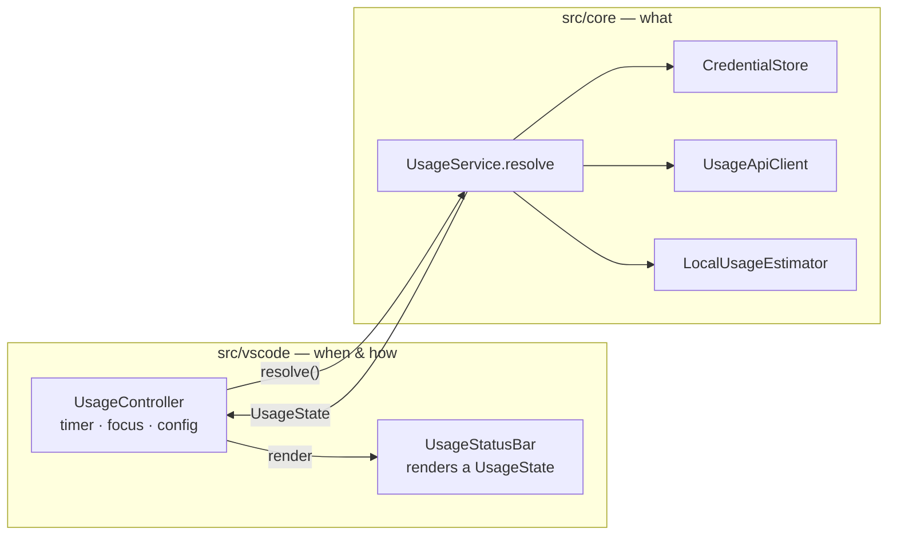
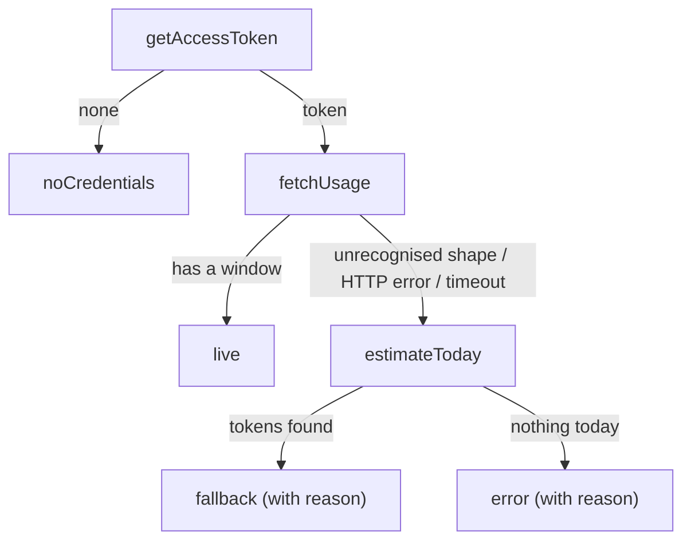

# Architecture

Tokenwatch is small, but it calls an undocumented endpoint with your credentials, so it's
built to be easy to audit and hard to break silently. This page explains how the pieces fit
together and why they're shaped the way they are.

## Layers

```
src/
├─ extension.ts      composition root: builds the objects, registers commands
├─ core/             what to show (no `vscode` import, unit-tested)
└─ vscode/           when to refresh and how to draw it
```

`src/core/` never imports `vscode`. That rule is what makes the logic testable with plain
`node --test` and no VS Code test harness. Anything that needs an editor API belongs in
`src/vscode/`.



| Module | Responsibility |
| --- | --- |
| `core/contracts.ts` | Interfaces `UsageService` depends on: `AccessTokenProvider`, `UsageFetcher`, `UsageEstimator`, `Logger`. |
| `core/credentials.ts` | `TokenSource` implementations (Keychain, credentials file) and `CredentialStore`, which tries them in order. |
| `core/usageApi.ts` | `UsageApiClient` (HTTP) and `parseUsageResponse` (pure). |
| `core/localUsage.ts` | `LocalUsageEstimator`: incremental scan of session logs. |
| `core/usageService.ts` | The refresh decision: live, fallback, or error. |
| `core/insights.ts` | Pure derived views: progress bars, pace projection, alert level. |
| `core/format.ts` | Pure formatting: percentages, durations, `↻` countdowns, token counts, one-line summaries. |
| `vscode/controller.ts` | Polling timer, focus gating, live config reload, manual refresh. |
| `vscode/statusBar.ts` | Turns a `UsageState` into text, colour and a Markdown tooltip. |
| `vscode/config.ts` | Reads and clamps `tokenwatch.*` settings. |

## The refresh decision

Every refresh produces exactly one `UsageState`, a discriminated union, so the status bar
can't end up half-updated:



A missing login skips the fallback on purpose. Showing a token count would hide the one
problem the user can actually fix.

## Alert levels

`assess()` in `core/insights.ts` turns a snapshot into one of four levels. The status bar can
only colour text and use two background colours, so each level maps onto one of these:

| Level | When | Shown as |
| --- | --- | --- |
| `ok` | Comfortable pace | Default colours |
| `watch` | At this pace, a window runs out before it resets | Yellow text (`charts.yellow`) |
| `warn` | A window is past the threshold, or will run out within the hour | Amber background, `$(warning)` |
| `critical` | A window is at 100% | Red background, `$(error)` |

Pace is the average since the window started: `percentUsed / (now − (resetsAt − length))`.
That needs no stored samples, so it is correct after a reload. It is suppressed in the
first 10 minutes of a window, when a single large prompt would distort it.

## Design decisions

**Credentials are re-read on every poll, never cached.** Claude Code refreshes its OAuth
token in the background, and re-reading picks up the new one without a reload. Reading the
Keychain costs a few milliseconds.

**`https.request`, not `fetch`.** VS Code patches Node's `https` module to honour the user's
`http.proxy` setting. Global `fetch` isn't patched, so it would fail behind corporate proxies.
The transport is still injectable (`UsageApiOptions.request`), which is how the tests run the
client against a local HTTP server.

**Unfocused windows skip polls.** Each VS Code window runs its own extension host, and so
its own Tokenwatch. Polling only from the focused window keeps the endpoint load at roughly
one request per interval, however many windows are open. A window that regains focus
refreshes immediately if its data is older than the interval.

**Concurrent refreshes share one in-flight promise.** A click during a timer tick, or a
focus event during a slow request, never sends a second request.

**The local fallback is incremental.** A single session log can exceed 100 MB, and one
measured day touched 1.1 GB across 28 files. The estimator keeps a byte offset per file and
reads only the appended tail. Measured on that day, the first scan took 2.2 s and later
scans took about 40 ms. It skips lines without `"usage"` before calling `JSON.parse`, and it
removes duplicate streamed messages using message id plus request id.

**The parser tolerates renames and keeps the raw body.** If the endpoint changes shape, the
extension falls back and logs the body instead of displaying a wrong number. See
[USAGE_ENDPOINT.md](USAGE_ENDPOINT.md).

**No runtime dependencies.** The `.vsix` contains only the compiled `src/`. Anyone can audit
what touches their credentials without reading a dependency tree.

## Extending

- **New credential location:** implement `TokenSource` in `core/credentials.ts` and add it
  to `CredentialStore.forPlatform`.
- **New quota window** (for example a per-model weekly limit): add an optional field to
  `UsageSnapshot`, parse it in `parseUsageResponse`, and render it in `statusBar.ts`.
- **New status bar state:** add a variant to `UsageState`. TypeScript then flags every
  `switch` that doesn't handle it.
