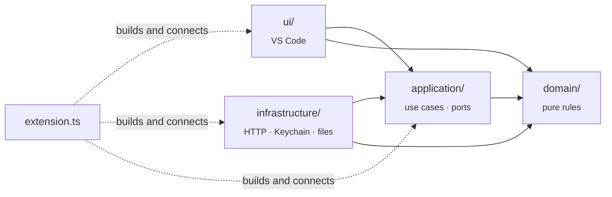
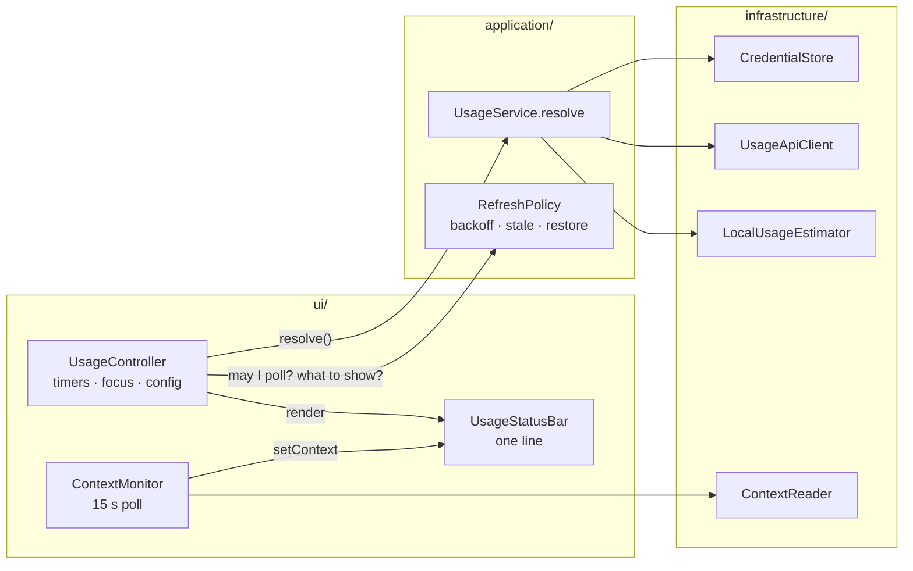
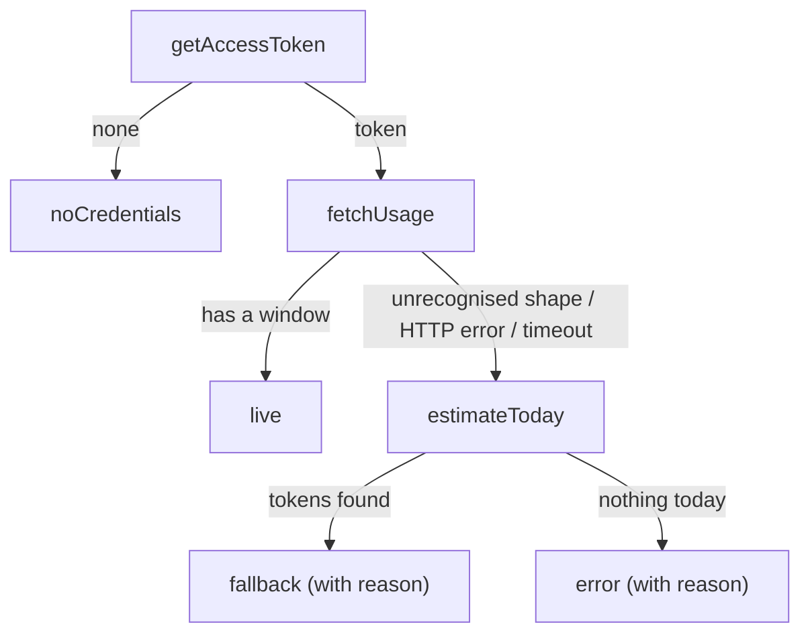

# Architecture

Tokenwatch is small, but it calls an undocumented endpoint with your credentials, so it's
built to be easy to audit and hard to break silently. This page explains how the pieces fit
together and why they're shaped the way they are.

## Layers

```
src/
├─ extension.ts      entry point: builds every object and wires the layers together
├─ domain/           pure rules and data: types, pace and alerts, formatting, parsing
├─ application/      use cases and ports: UsageService, RefreshPolicy, the interfaces they need
├─ infrastructure/   adapters to the outside world: HTTP, Keychain and file reads
└─ ui/               VS Code: status bar, timers and events, settings
```

Dependencies point inward:



| Layer | May import | Must not import |
| --- | --- | --- |
| `domain/` | nothing outside itself | `application/`, `infrastructure/`, `ui/`, `vscode`, Node I/O modules |
| `application/` | `domain/` | `infrastructure/`, `ui/`, `vscode`, Node I/O modules |
| `infrastructure/` | `domain/`, `application/` (to implement its ports) | `ui/`, `vscode` |
| `ui/` | `domain/`, `application/` | `infrastructure/` (it receives adapters through ports) |

ESLint enforces every row (`no-restricted-imports` in `eslint.config.ts`), so an import that
crosses a boundary fails `npm run lint` and CI. The payoff is testing: everything in `domain/`
and `application/` runs under plain `node --test` with in-memory fakes, no VS Code and no
network.

`extension.ts` sits outside the layers because it is the one place that knows all of them.
VS Code loads it (`"main": "./out/extension.js"`), and it constructs the infrastructure
adapters and hands them to the application and UI objects.



| Module | Responsibility |
| --- | --- |
| `domain/types.ts` | Shared data: `UsageSnapshot`, `UsageState`, `ContextReading`, settings. |
| `domain/usageResponse.ts` | Maps the endpoint's JSON onto a `UsageSnapshot`, accepting a few plausible key renames. |
| `domain/transcript.ts` | Parses transcript lines: a reply's context size, an entry's token count, folder → directory name. |
| `domain/contextWindow.ts` | Picks a model's context window: from settings, by prefix, or by 200k/1M inference. |
| `domain/insights.ts` | Progress bars, pace projection, alert level. |
| `domain/format.ts` | Percentages, durations, `↻` countdowns, token counts, one-line summaries. |
| `application/ports.ts` | Interfaces the use cases need: token, quota, local estimate, context, storage, logging. |
| `application/usageService.ts` | The refresh decision (live, fallback or error) and the backoff a failure calls for. |
| `application/refreshPolicy.ts` | Whether a request may go out, what to show while it can't, and what survives a reload. |
| `application/errors.ts` | `UsageApiError`, the error contract of the quota port. |
| `infrastructure/usageApiClient.ts` | The HTTPS request, status codes and `Retry-After`. |
| `infrastructure/credentials.ts` | Keychain and credentials-file token sources, tried in order. |
| `infrastructure/localUsageEstimator.ts` | Incremental scan of today's session logs. |
| `infrastructure/contextReader.ts` | Tail-reads the newest transcript for this window's folders. |
| `ui/controller.ts` | Quota timer, focus handling, settings reload, manual refresh and notifications. |
| `ui/contextMonitor.ts` | The 15-second context poll. |
| `ui/statusBar.ts` | Renders quota and context as one line, with colours and a Markdown tooltip. |
| `ui/config.ts` | Reads and clamps the `tokenwatch.*` settings. |

## Lifecycle

1. **Activation.** VS Code activates Tokenwatch once startup has finished (`onStartupFinished`),
   or earlier if one of its commands is run. `activate()` creates the log channel, the status
   bar item and the objects above, and registers two commands: `tokenwatch.refresh` and
   `tokenwatch.showLog`.
2. **Restore.** `RefreshPolicy.restore()` loads the numbers and backoff saved before the last
   reload, so the line appears at once (see [Design decisions](#design-decisions)).
3. **Polling.** `UsageController` polls quota every `pollIntervalSeconds` (default 180) while the
   window is focused and no backoff is running. `ContextMonitor` reads context every 15 seconds
   while focused. Both repaint the same status bar item.
4. **Settings changes** apply immediately: the timer is rescheduled and the item repainted.
5. **Shutdown.** Everything is registered in `context.subscriptions`, so VS Code disposes the
   timers, listeners and status bar item when the window closes.

## The refresh decision

Every quota refresh produces exactly one `UsageState`, a discriminated union, so the status
bar can't end up half-updated:



A missing login skips the fallback on purpose: showing a token count would hide the one
problem the user can actually fix.

`RefreshPolicy.record()` then decides what to display. On a rate limit it shows the last live
snapshot instead, marked stale, if that snapshot is under 30 minutes old.

## Alert levels

`assess()` in `domain/insights.ts` gives the quota one of four levels. A status bar item can
only change its text colour and use two background colours, so each level maps onto those:

| Level | When | Shown as |
| --- | --- | --- |
| `ok` | Comfortable pace | Default colours, `$(pulse)` |
| `watch` | At this pace, a window runs out before it resets | Yellow text (`charts.yellow`), `$(pulse)` |
| `warn` | A window is past `warnThresholdPercent`, or runs out within the hour | Amber background, `$(warning)` |
| `critical` | A window is at 100% | Red background, `$(error)` |

Context has its own two thresholds: yellow text from 70% and an amber background from 90%.
Text colour and background are chosen separately, each from the quota when the quota sets it
and from the context otherwise. So a nearly full context turns the item amber even when the
quota is fine, but it never hides a quota warning.

Pace is the average since the window started: `percentUsed / (now − (resetsAt − length))`.
It needs no stored samples, so it is correct straight after a reload. It is suppressed for the
first 10 minutes of a window, when one large prompt would distort it.

## Context size

`ContextReader` looks for transcripts in `~/.claude/projects/<folder>/`, where `<folder>` is
the workspace folder path with every non-alphanumeric character replaced by `-`. It goes
through them newest first and uses the first one that contains a reply. It reads from the end
of the file (256 KB, then 4 MB if a long tool result is in the way) back to the last
main-thread reply. That reply's `input_tokens + cache_creation_input_tokens +
cache_read_input_tokens` is the context size `/context` reports.

- Subagent replies (`isSidechain`) are skipped, because they have their own context.
- Entries aren't filtered by `cwd`: a session keeps its context after Claude changes directory.
- Two folders whose paths differ only in punctuation map to the same directory name. This
  collision is rare and accepted.

Transcripts record the model but not its window size, so `windowFor()` takes the size from
`tokenwatch.contextWindowTokens` (exact model id, then the longest matching prefix, then `"*"`).
Without a match it assumes 200k, or 1M once the session has grown past 200k, since only a 1M
window allows that.

Quota and context come from different sources and are polled at different rates: every
3 minutes and every 15 seconds. `ContextMonitor` has no status bar item of its own. It calls
`statusBar.setContext(reading)`, and `UsageStatusBar` repaints using the latest quota and the
latest context.

## Design decisions

**Credentials are re-read for every request, never cached.** Claude Code refreshes its OAuth
token in the background, and re-reading picks up the new one without a reload.

**`https.request`, not `fetch`.** VS Code has long routed Node's `https` module through the
user's `http.proxy` setting, while `fetch` only gained proxy support in later versions.
`https.request` therefore works behind corporate proxies across the whole supported range
(VS Code 1.85+). The transport is injectable (`UsageApiOptions.request`), which is how the
tests run the client against a local HTTP server.

**Unfocused windows skip polls.** Each VS Code window runs its own extension host, and so its
own Tokenwatch. Polling only from the focused window keeps the load at about one request per
interval however many windows are open. A window that regains focus refreshes at once if its
numbers are older than the interval and no backoff is running.

**Concurrent refreshes share one in-flight request.** A click during a timer tick, or a focus
event during a slow request, never sends a second request.

**A 429 backs off, and the last good numbers stay on screen.** Polling every 60 seconds drew a
429 on roughly every other request. The limit appears to be per account and shared with Claude
Code itself, so the default interval is 180 seconds. On a 429, `UsageApiClient` reads
`Retry-After` (seconds or an HTTP date) into `UsageApiError`, and `UsageService` sets the
backoff to that value or 180 seconds, whichever is longer. The server sends
`Retry-After: 0`, so honouring the header alone never backed off at all. While the backoff
runs, `RefreshPolicy` holds every request, manual ones included; a manual refresh reports when
the next attempt will be instead of drawing another 429.

**The last numbers and the backoff survive a reload.** `RefreshPolicy` saves the last good
response body, its fetch time and the backoff deadline under the key `tokenwatch.lastQuota`,
through the `KeyValueStore` port: VS Code's `globalState` in production, an in-memory map in
tests. On activation it restores them. The line appears at once, a running backoff carries
on, and no request is sent while the saved numbers are newer than the poll interval. Before
this, every reload sent an immediate request, which often drew a 429.

**The local fallback is incremental.** A single session log can exceed 100 MB, and one
measured day touched 1.1 GB across 28 files. The estimator keeps a byte offset per file and
reads only what has been appended since. On that day the first scan took 2.2 s and later scans
about 40 ms. It skips lines without `"usage"` before calling `JSON.parse`, and counts a
streamed message once, using its message id and request id.

**The parser tolerates renames and keeps the raw body.** If the endpoint changes shape,
Tokenwatch falls back and logs the body rather than showing a wrong number. See
[USAGE_ENDPOINT.md](USAGE_ENDPOINT.md).

**The log reads like the status bar.** Each quota refresh, and each change in context, writes
the same one line the status bar shows. Restore details are logged at Debug level only. The
token never reaches the log; see [SECURITY.md](SECURITY.md).

**No runtime dependencies.** The only code in the `.vsix` is the compiled `src/`, so anyone can
audit what touches their credentials without reading a dependency tree.

## Extending

- **New credential location:** implement `TokenSource` in `infrastructure/credentials.ts` and
  add it to `CredentialStore.forPlatform`.
- **New quota window** (for example a per-model weekly limit): add an optional field to
  `UsageSnapshot` in `domain/types.ts`, parse it in `domain/usageResponse.ts`, and render it in
  `ui/statusBar.ts`.
- **New data source** (say, another tool's logs): add a port to `application/ports.ts`,
  implement it in `infrastructure/`, and wire it in `extension.ts`. Nothing in `domain/` or
  `application/` needs to know where the data comes from.
- **New status bar state:** add a variant to `UsageState`. TypeScript then flags every
  `switch` that doesn't handle it.
