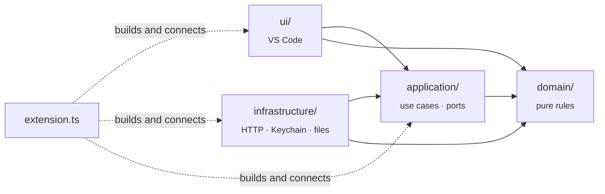
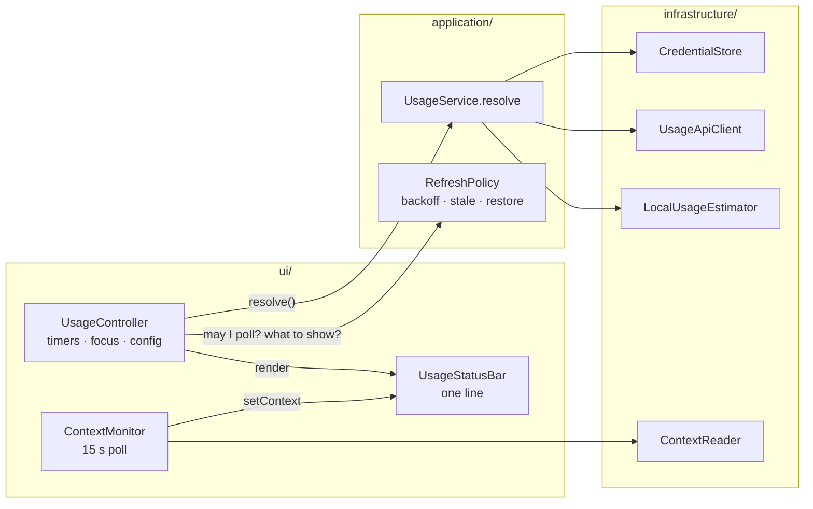
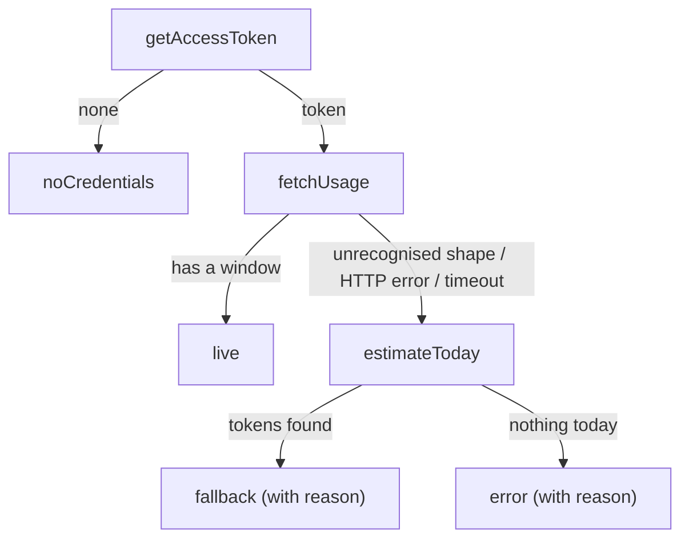

# Architecture

Tokenwatch is small, but it calls an undocumented endpoint with your credentials, so it's
built to be easy to audit and hard to break silently. This page explains how the pieces fit
together and why they're shaped the way they are.

## Layers

```
src/
├─ extension.ts      composition root: builds every object and wires the layers together
├─ domain/           pure rules and data: types, pace and alerts, formatting, parsing
├─ application/      use cases and ports: UsageService, RefreshPolicy, the interfaces they need
├─ infrastructure/   adapters to the outside world: HTTP, Keychain and file reads
└─ ui/               VS Code: status bar, timers and events, settings
```

Dependencies point inward only:



| Layer | May import | Must not import |
| --- | --- | --- |
| `domain/` | nothing outside itself | `application/`, `infrastructure/`, `ui/`, `vscode`, Node I/O modules |
| `application/` | `domain/` | `infrastructure/`, `ui/`, `vscode`, Node I/O modules |
| `infrastructure/` | `domain/`, `application/` (to implement its ports) | `ui/`, `vscode` |
| `ui/` | `domain/`, `application/` | `infrastructure/` (it gets adapters through ports) |

ESLint enforces every row (`eslint.config.ts`, `no-restricted-imports`), so an import across a
boundary fails `npm run lint` and CI. The payoff is testing: everything in
`domain/` and `application/` runs under plain `node --test` with in-memory fakes, no VS Code
and no network.



| Module | Responsibility |
| --- | --- |
| `domain/types.ts` | Shared data: `UsageSnapshot`, `UsageState`, `ContextReading`, settings. |
| `domain/usageResponse.ts` | Maps the endpoint's JSON onto a `UsageSnapshot`, tolerating renames. |
| `domain/transcript.ts` | Parses transcript lines: context size of a reply, tokens of an entry, folder → directory name. |
| `domain/contextWindow.ts` | Picks a model's context window (settings, prefix match, or 200k/1M inference). |
| `domain/insights.ts` | Progress bars, pace projection, alert level. |
| `domain/format.ts` | Percentages, durations, `↻` countdowns, token counts, one-line summaries. |
| `application/ports.ts` | Interfaces the use cases need: tokens, quota, estimates, context, storage, logging. |
| `application/usageService.ts` | The refresh decision: live, fallback, or error; maps failures to backoff. |
| `application/refreshPolicy.ts` | When a request may go out, what to show while it can't, and what survives a reload. |
| `application/errors.ts` | `UsageApiError`, the error contract of the quota port. |
| `infrastructure/usageApiClient.ts` | HTTPS request, status codes, `Retry-After`. |
| `infrastructure/credentials.ts` | Keychain and credentials-file token sources, tried in order. |
| `infrastructure/localUsageEstimator.ts` | Incremental scan of today's session logs. |
| `infrastructure/contextReader.ts` | Tail-reads the newest transcript for this window's folders. |
| `ui/controller.ts` | Quota timer, focus gating, settings reload, manual refresh and notifications. |
| `ui/contextMonitor.ts` | The 15 s context poll. |
| `ui/statusBar.ts` | Renders quota and context as one line, with colours and a Markdown tooltip. |
| `ui/config.ts` | Reads and clamps `tokenwatch.*` settings. |

## The refresh decision

Every refresh produces exactly one `UsageState`, a discriminated union, so the status bar
can't end up half-updated:



A missing login skips the fallback on purpose. Showing a token count would hide the one
problem the user can actually fix.

## Alert levels

`assess()` in `domain/insights.ts` turns a snapshot into one of four levels. The status bar can
only colour text and use two background colours, so each level maps onto one of these:

| Level | When | Shown as |
| --- | --- | --- |
| `ok` | Comfortable pace | Default colours |
| `watch` | At this pace, a window runs out before it resets | Yellow text (`charts.yellow`) |
| `warn` | A window is past the threshold, or will run out within the hour | Amber background, `$(warning)` |
| `critical` | A window is at 100% | Red background, `$(error)` |

Pace is the average since the window started: `percentUsed / (now − (resetsAt − length))`.
That needs no stored samples, so it is correct after a reload. It is suppressed in the
first 10 minutes of a window, when a single large prompt would distort it.

## Context size

`ContextReader` finds this window's session transcripts in
`~/.claude/projects/<folder with non-alphanumerics replaced by '->/` and takes the newest
file. It reads from the end of the file (256 KB, then 4 MB if a long tool result is in the
way) back to the last main-thread reply. That reply's
`input_tokens + cache_creation_input_tokens + cache_read_input_tokens` is the context size
`/context` reports. Subagent (`isSidechain`) replies are skipped because they have their own
context. Entries aren't filtered by `cwd`, since a session keeps its context after Claude
changes directory.

Transcripts record the model but not its window size, so `windowFor()` takes it from
`tokenwatch.contextWindowTokens` (exact id, longest prefix, then `"*"`). Otherwise it infers
200k, or 1M once the session has grown past 200k, which only a 1M window allows.

Quota and context are polled independently — different sources, different rates (180s vs 15s)
— but rendered as one line by `UsageStatusBar`: `ContextMonitor` has no status bar item of its
own, it calls `statusBar.setContext(reading)` and `UsageStatusBar` repaints from whichever of
quota or context was set most recently. Quota's alert colour always wins over context's,
since quota (you're about to be rate-limited) is the more urgent signal.

## Design decisions

**Credentials are re-read on every poll, never cached.** Claude Code refreshes its OAuth
token in the background, and re-reading picks up the new one without a reload. Reading the
Keychain costs a few milliseconds.

**`https.request`, not `fetch`.** VS Code patches Node's `https` module to honour the user's
`http.proxy` setting. Global `fetch` isn't patched, so it would fail behind corporate proxies.
The transport is still injectable (`UsageApiOptions.request`), which is how the tests run the
client against a local HTTP server.

**Unfocused windows skip polls.** Each VS Code window runs its own extension host, and so
its own Tokenwatch. Polling only from the focused window keeps the endpoint load at roughly
one request per interval, however many windows are open. A window that regains focus
refreshes immediately if its data is older than the interval.

**Concurrent refreshes share one in-flight promise.** A click during a timer tick, or a
focus event during a slow request, never sends a second request.

**A 429 backs off, and the last good numbers stay on screen.** Polling every 60s drew a 429
on roughly every other request in practice; the limit appears to be per account and shared with
Claude Code itself, so the default interval is 180s. On a 429, `UsageApiClient` parses
`Retry-After` (seconds, or an HTTP date) onto `UsageApiError`, and `UsageService` sets
`retryAfterSeconds` to that value or 180s, whichever is longer. Honouring the header alone
never engaged the backoff, because the server sends `Retry-After: 0`. `RefreshPolicy` then
holds every poll until the backoff ends, including manual refreshes, which report the wait
instead of drawing another 429. Meanwhile it keeps rendering the last live snapshot, if under
30 minutes old, marked `staleReason: 'rate-limited'`, rather than switching to the local token
count.

**The last numbers and the backoff survive a reload.** `RefreshPolicy` saves the last good
response body, its fetch time and the backoff deadline through the `KeyValueStore` port
(VS Code's `globalState` in production, an in-memory map in tests). On activation it
restores them: the line appears at once, a running backoff isn't reset, and no request is
sent while the saved numbers are newer than the poll interval. Before this, every reload sent
a request immediately, which was the most common source of 429s.

**The local fallback is incremental.** A single session log can exceed 100 MB, and one
measured day touched 1.1 GB across 28 files. The estimator keeps a byte offset per file and
reads only the appended tail. Measured on that day, the first scan took 2.2 s and later
scans took about 40 ms. It skips lines without `"usage"` before calling `JSON.parse`, and it
removes duplicate streamed messages using message id plus request id.

**The parser tolerates renames and keeps the raw body.** If the endpoint changes shape, the
extension falls back and logs the body instead of displaying a wrong number. See
[USAGE_ENDPOINT.md](USAGE_ENDPOINT.md).

**No runtime dependencies.** The `.vsix` contains only the compiled `src/`. Anyone can audit
what touches their credentials without reading a dependency tree.

## Extending

- **New credential location:** implement `TokenSource` in `infrastructure/credentials.ts` and add it
  to `CredentialStore.forPlatform`.
- **New quota window** (for example a per-model weekly limit): add an optional field to
  `UsageSnapshot` (`domain/types.ts`), parse it in `domain/usageResponse.ts`, and render it in
  `ui/statusBar.ts`.
- **New data source** (say, another editor's logs): add a port to `application/ports.ts`,
  implement it in `infrastructure/`, and wire it in `extension.ts`. Nothing in `domain/` or
  `application/` needs to know where the data comes from.
- **New status bar state:** add a variant to `UsageState`. TypeScript then flags every
  `switch` that doesn't handle it.
